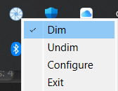

# Focus

## Description

This project supports neurodivergent individuals by providing a lightway way to dim all windows except for the active window to reduce distractions.  The project currently supports only Windows systems, but support for other OSes and windowing environments may be added in the future.

## Table of Contents

- [Installation](#installation)
- [Usage](#usage)
- [Licenses](#licenses)

## Installation

To allow for execution in restricted environments, no installation is required; however, several local dependencies are needed.  Please run `pip install -r requirements.txt` or manually pip install the dependencies.

## Usage

### Description

Run `python focus.py`

By default, the program wll dim all windows except for the active window by making them 50% transparent.  An icon that matches [icon.png](icon.png) in this repository will also appear in your system tray.  You can right click the icon to undim all windows, configure the transparency setting, or exit the program.  Exiting the program will cause all windows to undim.

### Screenshot

## Licenses

### Source Code
Copyright (C) 2024 David Cowern

This program is free software: you can redistribute it and/or modify it under the terms of the GNU General Public License as published by the Free Software Foundation, either version 3 of the License, or (at your option) any later version.

This program is distributed in the hope that it will be useful, but WITHOUT ANY WARRANTY; without even the implied warranty of MERCHANTABILITY or FITNESS FOR A PARTICULAR PURPOSE. See the GNU General Public License for more details.

You should have received a copy of the GNU General Public License along with this program. If not, see <https://www.gnu.org/licenses/>. 

### Icon
The icon file associated with this program is from Icons8.com and is covered by its own license.

Icon Source: <https://icons8.com/icon/50274/aperture>
Icon License: <https://icons8.com/license>
